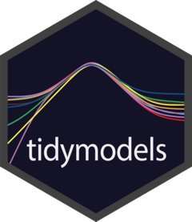

<!-- README.md is generated from README.Rmd. Please edit that file -->

```{r}
#| echo: false
knitr::opts_chunk$set(
  collapse = TRUE,
  comment = "#>",
  fig.path = "man/figures/README-",
  out.width = "100%"
)
```

# tidymodels <a href='https://tidymodels.tidymodels.org'></a>

<!-- badges: start -->
[](https://github.com/tidymodels/tidymodels/actions/workflows/R-CMD-check.yaml)
[](https://app.codecov.io/gh/tidymodels/tidymodels?branch=main)
[](https://CRAN.r-project.org/package=tidymodels)
[](https://CRAN.r-project.org/package=tidymodels)
[](https://lifecycle.r-lib.org/articles/stages.html)
<!-- badges: end -->

## Overview

[tidymodels](https://www.tidymodels.org/) is a "meta-package" for modeling and statistical analysis that shares the underlying design philosophy, grammar, and data structures of the [tidyverse](https://www.tidyverse.org/).

It includes a core set of packages that are loaded on startup:

* [`broom`](https://broom.tidymodels.org/) takes the messy output of built-in functions in R, such as `lm`, `nls`, or `t.test`, and turns them into tidy data frames.

* [`dials`](https://dials.tidymodels.org) has tools to create and manage values of tuning parameters.

* [`dplyr`](https://dplyr.tidyverse.org) contains a grammar for data manipulation. 

* [`ggplot2`](https://ggplot2.tidyverse.org) implements a grammar of graphics. 

* [`infer`](https://infer.tidymodels.org) is a modern approach to statistical inference.

* [`parsnip`](https://parsnip.tidymodels.org) is a tidy, unified interface to creating models. 

* [`purrr`](https://purrr.tidyverse.org) is a functional programming toolkit.

* [`recipes`](https://recipes.tidymodels.org) is a general data preprocessor with a modern interface. It can create model matrices that incorporate feature engineering, imputation, and other help tools.

* [`rsample`](https://rsample.tidymodels.org) has infrastructure for _resampling_ data so that models can be assessed and empirically validated. 

* [`tibble`](https://tibble.tidyverse.org) has a modern re-imagining of the data frame.

* [`tune`](https://tune.tidymodels.org) contains the functions to optimize model hyper-parameters.

* [`workflows`](https://workflows.tidymodels.org) has methods to combine pre-processing steps and models into a single object. 

* [`yardstick`](https://yardstick.tidymodels.org) contains tools for evaluating models (e.g. accuracy, RMSE, etc.).

A list of all tidymodels functions across different CRAN packages can be found at <https://www.tidymodels.org/find/>.

You can install the released version of tidymodels from [CRAN](https://CRAN.r-project.org) with:

``` r
install.packages("tidymodels")
```

Install the development version from GitHub with:

``` r
# install.packages("pak")
pak::pak("tidymodels/tidymodels")
```

When loading the package, the versions and conflicts are listed:


```{r}
library(tidymodels)
```

## Contributing

This project is released with a [Contributor Code of Conduct](https://contributor-covenant.org/version/2/1/CODE_OF_CONDUCT.html). By contributing to this project, you agree to abide by its terms.

- For questions and discussions about tidymodels packages, modeling, and machine learning, please [post on RStudio Community](https://forum.posit.co/new-topic?category_id=15&tags=tidymodels,question).

- Most issues will likely belong on the GitHub repo of an individual package. If you think you have encountered a bug with the tidymodels metapackage itself, please [submit an issue](https://github.com/tidymodels/tidymodels/issues).

- Either way, learn how to create and share a [reprex](https://reprex.tidyverse.org/articles/articles/learn-reprex.html) (a minimal, reproducible example), to clearly communicate about your code.

- Check out further details on [contributing guidelines for tidymodels packages](https://www.tidymodels.org/contribute/) and [how to get help](https://www.tidymodels.org/help/).
